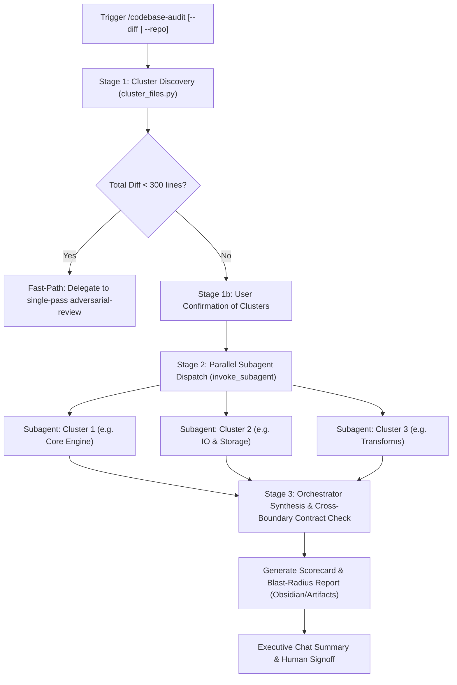

# Multi-Agent Adversarial Codebase Audit (`codebase-audit`)

Scalable whole-codebase and large-diff adversarial audit engine that partitions code into orthogonal functional clusters, dispatches parallel reviewer subagents with isolated context windows and targeted test execution, and synthesizes findings into a prioritized blast-radius scorecard.

---

## When to Use

- **Large Pull Requests / Feature Branches:** Diffs exceeding ~500 lines or >10 files where a single review agent suffers from context degradation.
- **Pre-Merge / Milestone Sweeps:** Multi-commit releases, paper submissions, or major architectural refactors.
- **Whole-Codebase Audits:** Full repository sweeps partitioned into domain boundaries.

---

## 3-Stage Multi-Agent Audit Workflow



---

## Stage 1: Automated Cluster Discovery & Confirmation

### 1. Run Cluster Discovery Engine
Execute the clustering engine inside the target repository or worktree:

```bash
# For diff comparison (branch/commits against base):
python3 ~/.gemini/skills/codebase-audit/scripts/cluster_files.py --diff [optional_base_ref]

# For whole-repository sweep:
python3 ~/.gemini/skills/codebase-audit/scripts/cluster_files.py --repo <path_to_repo>
```

### 2. Fast-Path Fallback for Small Diffs
If `cluster_files.py` returns `"is_small_diff": true` (diff < 300 lines and $\le 3$ files), do NOT spawn multiple subagents. Immediately advise the user and delegate to single-agent [`adversarial-review`](../adversarial-review/SKILL.md).

### 3. Stage 1b: User Confirmation Gate
Present discovered clusters to the user in a clean table:

```markdown
### Proposed Audit Clusters
- **Cluster 1: Core Engine** (4 files, 820 lines) — Test target: `tests/dynamics/`
- **Cluster 2: IO & Storage** (3 files, 650 lines) — Test target: `tests/io/`
- **Cluster 3: Transforms** (2 files, 340 lines) — Test target: `tests/transforms/`

Confirm cluster partition to launch parallel subagents?
```

---

## Stage 2: Parallel Subagent Dispatch

### 1. Concurrent Subagent Invocation
Launch concurrent subagents using `invoke_subagent` (`TypeName: self`, `Role: Cluster Auditor [<Cluster Name>]`, `Workspace: inherit`).

### 2. Subagent Context Compaction Block
Parent agent MUST supply a compacted context block ( $\le 30$ lines / ~400 words) in each subagent's prompt:

```markdown
### Context Compaction Block
- **Cluster ID & Domain**: [cluster_id] - [Domain Name]
- **Target Source Files**: [list of files in this cluster]
- **Associated Test Suite**: [test target files/directories]
- **Active Constraints**: Local laptop execution; empirical line-number grounding; max 10 prioritized findings.
- **Test Command**: python3 ~/.gemini/scripts/run_in_env.py <worktree_path> pytest <cluster_tests> -o cache_dir=/tmp/pytest_cache_<cluster_id>
```

### 3. Subagent Execution Rules
Each subagent MUST:
1. **Run Cluster Tests First:** Execute the designated test suite using `run_in_env.py` with an isolated tmp pytest cache.
2. **Inspect Code & Diffs in Chunks:** Read source files via `view_file` in chunks ($\le 800$ lines).
3. **Strict Empirical Grounding:** Only report findings backed by byte-for-byte exact `file:line` citations and test logs. Hypothetical bugs are strictly prohibited.
4. **Emit Structured Subagent Audit Card:**
   - Top-level `VERDICT: [APPROVE | NEEDS_REVISION | REJECT]`
   - Max 10 prioritized findings (P0 Blocker, P1 High, P2 Polish) with line ranges, empirical traces, and suggested diff patches.
   - `### Cross-Boundary Contract Flags`: Note any modified exported symbols, signature changes, or assumptions about external modules.
5. **Terminate Turn Immediately:** Stop calling tools after outputting the audit card.

### 4. Subagent Lifecycle Cleanup
Once subagents complete and report back, the parent agent MUST clean up subagent instances:
```python
manage_subagents(Action="kill", ConversationIds=[...])
```

---

## Stage 3: Unified Synthesis, Cross-Boundary Check & Blast Radius

### 1. Central Orchestrator Scratchpad
The parent agent initializes and records cluster findings and cross-boundary flags in:
`<appDataDir>/brain/<conversation-id>/scratch/audit_scratchpad.md`

### 2. Cross-Boundary Contract Verification
The orchestrator specifically audits the interface contracts between clusters:
- Inspect callers across cluster boundaries for any flagged exported symbols or signature changes.
- Verify that shared data structures, configuration schemas, and coordinate/unit conventions match across all producer-consumer pairs.

### 3. Synthesize Scorecard & Blast-Radius Report
Generate a formal audit report using the [audit_scorecard_template.md](resources/audit_scorecard_template.md) template.

**Report Storage Location:**
- Prefer Obsidian Vault: `Projects/<project-name>/audit_report_<date>.md`
- Fallback: `artifacts/audit_report_<date>.md`

**Priority Tiers:**
- `P0 Blocker`: Corrupts trained model weights, numerical divergence, data corruption, crashes.
- `P1 High`: Silent logic drift, untested boundary defects, subtle contract mismatches.
- `P2 Polish`: Documentation accuracy, naming consistency, defensive cleanups.

**Blast Radius Assessment:**
Explicitly evaluate downstream impact on:
- Model checkpoints & training runs (e.g. weight invalidation, NaN risks).
- Preprocessed datasets & cached pipelines.
- Scientific metrics & publication figures.
- Production services / API contracts.

### 4. Executive Summary Output
Post a concise summary directly in chat highlighting:
- Health verdict (`APPROVE`, `NEEDS_REVISION`, `REJECT`).
- Cluster pass/fail breakdown.
- Top P0/P1 issues requiring remediation.
- Link to the generated full audit report artifact.
