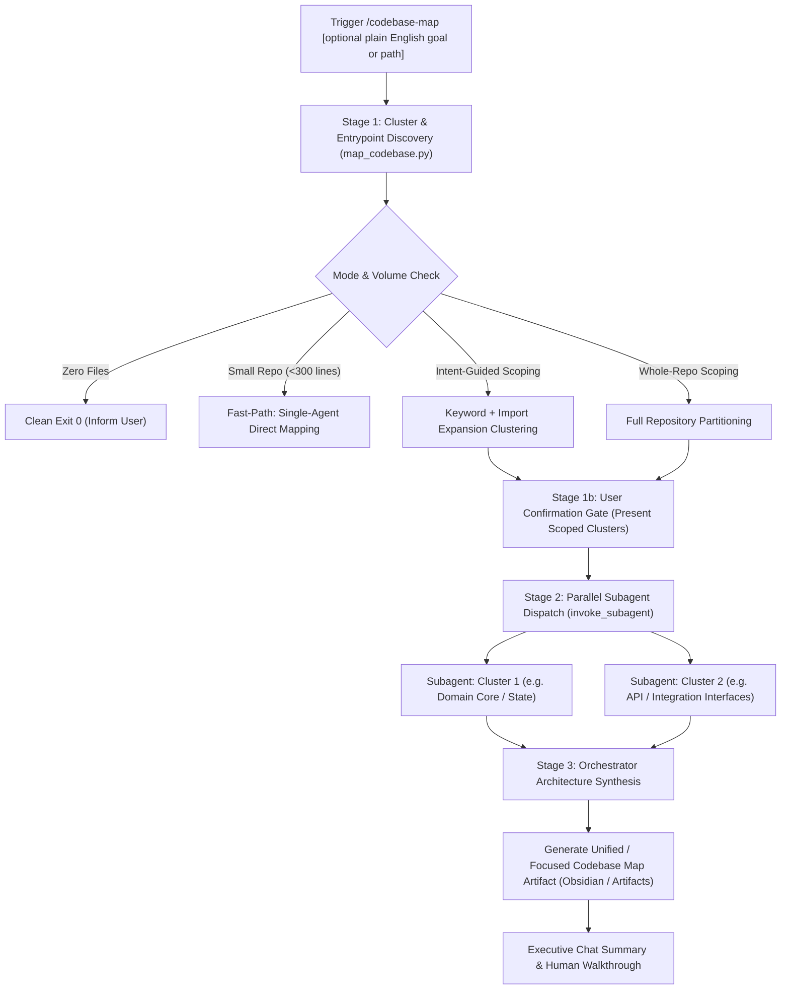

# Multi-Agent Codebase Mapping (`codebase-map`)

Scalable whole-codebase and intent-scoped architectural discovery engine that partitions unfamiliar repositories into orthogonal functional clusters, dispatches parallel explorer subagents with isolated context windows, detects polyglot entrypoints (CLI, API, workers, mains), and synthesizes findings into a unified, living architecture map and developer onboarding guide (`codebase_map.md`).

---

## When to Use

- **New Codebase Onboarding:** Rapidly ramp up on an unfamiliar repository without suffering context window degradation.
- **Intent-Directed Task Preparation:** Ask in plain English (e.g. `/codebase-map how session auth works` or `/codebase-map I want to add Stripe webhooks`) to map only relevant subsystems, dependencies, and extension points.
- **Pre-Spec & Pre-Plan Architectural Alignment:** Map system boundaries and data models before drafting feature specs or major refactors.
- **Living Architectural Documentation:** Generate up-to-date Mermaid topology diagrams, call graphs, and developer cookbook recipes.

---

## 3-Stage Multi-Agent Mapping Workflow



---

## Stage 1: Cluster & Entrypoint Discovery

### 1. Run Discovery Engine
Execute the mapping engine inside the target repository:

```bash
# Whole-repository architecture map:
python3 ~/.gemini/skills/codebase-map/scripts/map_codebase.py --repo <path_to_repo>

# Path-scoped architecture map:
python3 ~/.gemini/skills/codebase-map/scripts/map_codebase.py --repo <path_to_repo> --scope src/auth

# Intent-guided / Goal-directed architecture map:
python3 ~/.gemini/skills/codebase-map/scripts/map_codebase.py --repo <path_to_repo> --goal "how user authentication and JWT session validation works"
```

### 2. Edge Case & Fast-Path Contracts
- **Zero Source Files:** If `total_files == 0`, the engine prints empty summary JSON with `is_small_repo: true` and exits with code 0. Orchestrator informs user and halts cleanly.
- **Small Repository Fast-Path:** If `total_lines < 300` and `total_files <= 3`, `is_small_repo` is true. Orchestrator bypasses subagent dispatch and generates the architecture map directly in the parent context.
- **Library / SDK Fallback:** If zero explicit entrypoints are detected, architecture mode is classified as `library_sdk` and public API surface is extracted from package root exports (`__init__.py`, `index.ts`, `mod.rs`, `lib.go`).

### 3. Stage 1b: User Confirmation Gate
Present discovered/scoped domain clusters and detected entrypoints to the user:

```markdown
### Proposed Architecture Mapping Scope
- **Active Goal**: "how session auth and JWT validation works"
- **Cluster 1: Authentication Core** (`src/auth/`, 4 files, 450 lines) — Entrypoint: `src/auth/jwt.py`
- **Cluster 2: User Persistence & DB** (`src/db/user.py`, `src/models/user.py`, 2 files, 310 lines)

Confirm cluster scope to launch mapping subagents?
```

---

## Stage 2: Parallel Subagent Dispatch

### 1. Concurrent Subagent Invocation
Launch concurrent explorer subagents using `invoke_subagent` (`TypeName: self` or `research`, `Role: Cluster Mapper [<Cluster Name>]`, `Workspace: inherit`).

### 2. Subagent Context Compaction Block
Parent agent passes a structured context block ($\le 30$ lines / ~400 words) in each subagent's prompt:

```markdown
### Context Compaction Block
- **Cluster ID & Domain**: [cluster_id] - [Domain Name]
- **Target Source Files**: [list of files in this cluster]
- **Detected Entrypoints**: [list of detected entrypoints in this cluster, if any]
- **User Focus / Goal**: [plain English intent or 'Whole Repository Architecture']
- **Active Constraints**: Local laptop execution; empirical line-number grounding; strict markdown link citations [Symbol](file:///path/to/file#L1-L20).
- **Extraction Target**: Domain responsibilities, exported symbols/APIs, core data structures, internal control flow, cluster Mermaid diagram, invariants.
```

### 3. Subagent Execution Rules
Each subagent MUST:
1. **Inspect Code in Chunks:** Read source files via `view_file` in chunks ($\le 800$ lines). For monolithic files ($>3000$ lines), use Tier 1 indexing then Tier 2 deep-dive.
2. **Strict Empirical Grounding:** Cite all exported symbols, models, and interfaces with exact markdown links: `[ClassName](file:///path/to/file#L10-L40)`.
3. **Emit Structured Domain Card:**
   - **Domain Overview:** 2-3 sentences defining the cluster's boundary.
   - **Public API & Exported Symbols:** Classes, functions, and interfaces exposed to other modules.
   - **Core Data Structures & State:** Dataclasses, schemas, Pydantic models, or state containers.
   - **Internal Control Flow:** Step-by-step execution path of operations in this cluster.
   - **Cluster Mermaid Flow Diagram:** Visual diagram of interactions within this cluster.
   - **Invariants & Conventions:** Specific constraints (concurrency, idempotency, caching, units).
4. **Terminate Turn Immediately:** Stop calling tools after outputting the Domain Card.

### 4. Subagent Lifecycle Cleanup
Once all subagents return, parent agent terminates them via:
```python
manage_subagents(Action="kill", ConversationIds=[...])
```

---

## Stage 3: Orchestrator Architecture Synthesis

### 1. Synthesize Unified Architecture Map
Synthesize all cluster Domain Cards into a unified architecture document using the [codebase_map_template.md](resources/codebase_map_template.md) template.

**Map Storage Location:**
- Prefer Obsidian Vault: `Projects/<project-name>/codebase_map.md` (or `codebase_map_<goal_slug>.md`)
- Fallback: `artifacts/codebase_map.md`

### 2. Key Synthesis Sections
- **System Topology Diagram:** Top-level Mermaid flow/architecture diagram connecting all clusters.
- **End-to-End Dataflow & Lifecycles:** Tracing user requests / operations from entrypoints through intermediate processing to persistence and back.
- **Global Abstractions & Primitives Glossary:** Index of the most important concepts, interfaces, and classes.
- **Developer Cookbook ("How-To Recipes"):**
  - Goal-Specific Recipe (e.g. "Step-by-step guide to implement [User Goal]").
  - Standard Extension Recipes (how to add a new command / endpoint / transform).
  - How to run tests and debug locally.
- **Invariants & Gotchas:** Undocumented conventions, threading/concurrency assumptions, environment prerequisites.

### 3. Executive Chat Walkthrough
Post a concise summary directly in chat highlighting:
- Overall system paradigm (e.g. modular monolith, microservice, pipeline DAG).
- Primary entrypoints and dataflow summary.
- Key extension points answering the user's goal.
- Link to the generated full architecture map artifact.
