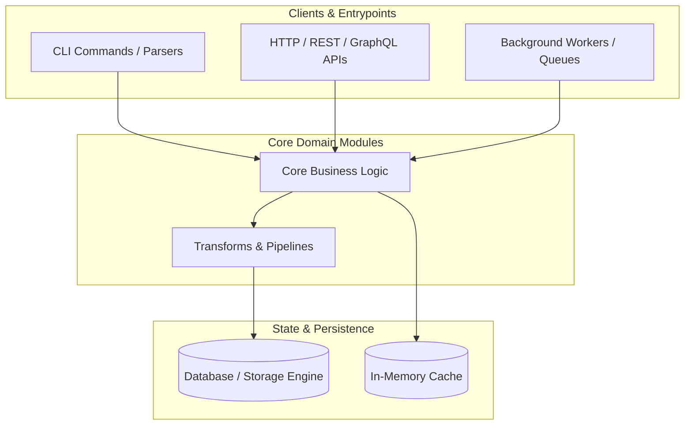
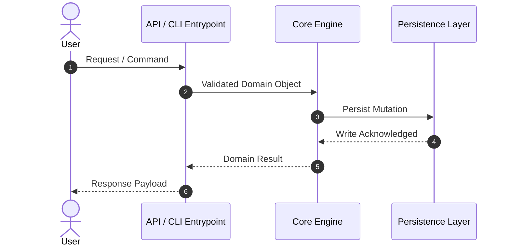

# Codebase Architecture Map: [Repository / Subsystem Name]

**Mapping Mode:** [Whole-Repository Architecture | Intent-Scoped Map (`[user_goal]`)]  
**Audited Target Path:** `[repo_path or scoped_path]`  
**Total Volume:** `[N]` files, `[M]` lines across `[K]` functional clusters  
**Architecture Classification:** `[Application / Service Engine | Polyglot Service | Library / SDK Engine]`  
**Mapping Date:** [YYYY-MM-DD]  

---

## 1. System Topology & High-Level Architecture

*Executive structural diagram illustrating key system components, external clients, entrypoints, and backing stores.*



### System Architecture Paradigm
- **Primary Pattern:** [e.g., Modular Monolith / Hexagonal Architecture / Event-Driven Microservice / Pipeline DAG]
- **Entrypoint Layer:** [Summary of primary entrypoints: CLI tools, API routes, or worker tasks]
- **Data & State Strategy:** [Summary of state persistence, caching, and serialization models]

---

## 2. Domain & Module Breakdown

*Decomposition of codebase clusters, their boundaries, key abstractions, and public interfaces.*

### Cluster 1: [Domain Name, e.g., Core Engine & Models]
- **Directory Scope:** `[src/core/]` (`[N]` files, `[M]` lines)
- **Domain Responsibilities:** [2-3 sentences explaining what this cluster does and does not do]
- **Key Exported Interfaces & Types:**
  - [`MainClass`](file:///path/to/file.py#L10-L40): Primary orchestrator for business logic.
  - [`DataModel`](file:///path/to/models.py#L15-L35): Core entity schema representing system state.
- **Internal Control Flow:**
  1. Receives input parameters from entrypoint layer.
  2. Normalizes and validates attributes via schema layer.
  3. Executes domain operations and emits results.
- **Cluster Component Diagram:**
  ```mermaid
  flowchart LR
      A["Input Handler"] --> B["State Normalizer"]
      B --> C["Execution Core"]
  ```

---

### Cluster 2: [Domain Name, e.g., API & Interface Layer]
- **Directory Scope:** `[src/api/]` (`[N]` files, `[M]` lines)
- **Domain Responsibilities:** [Description of interface adapters, request validation, authentication]
- **Detected Entrypoints:**
  - [`routes.py:L15`](file:///path/to/routes.py#L15): `GET /api/v1/health`
  - [`routes.py:L40`](file:///path/to/routes.py#L40): `POST /api/v1/resource`
- **Key Exported Interfaces & Types:**
  - [`RouterAdapter`](file:///path/to/router.py#L20-L50): Translates HTTP requests to domain calls.

---

## 3. End-to-End Dataflows & Execution Lifecycles

*Step-by-step traces of critical lifecycles (e.g., Request Handling, Batch Ingestion, or User-Specified Feature Goal).*

### Trace 1: [Primary Lifecycle / Goal Execution Path]
1. **Entrypoint Trigger:** User invokes CLI / sends HTTP request to [`entrypoint.py`](file:///path/to/entrypoint.py#L10).
2. **Authentication / Parameter Parsing:** Validates payload against [`schema.py`](file:///path/to/schema.py#L20).
3. **Domain Processing:** Calls [`engine.process()`](file:///path/to/engine.py#L45) to execute core algorithms.
4. **State Mutation / Persistence:** Writes updated record to [`store.py`](file:///path/to/store.py#L80).
5. **Response / Output:** Returns structured result to caller.



---

## 4. Developer Cookbook ("How-To" Recipes)

*Actionable recipes showing engineers how to extend or modify the system safely.*

### Recipe 1: [Goal-Specific Recipe or How to Add a New Feature]
- **Step 1:** Define the new model in [`models/`](file:///path/to/models/).
- **Step 2:** Implement the core business logic method in [`engine/`](file:///path/to/engine/).
- **Step 3:** Register the entrypoint in [`cli/`](file:///path/to/cli/) or [`api/`](file:///path/to/api/).
- **Step 4:** Add integration test in [`tests/`](file:///path/to/tests/).

### Recipe 2: Local Setup & Testing Quickstart
```bash
# Run unit & integration test suite
python3 ~/.gemini/scripts/run_in_env.py <workspace_path> pytest

# Run linter & code health check
python3 ~/.gemini/scripts/run_in_env.py <workspace_path> ruff check .
```

---

## 5. Global Invariants, Contracts & Gotchas

*Implicit contracts, threading assumptions, and non-obvious conventions.*

- **Data Immutability:** [e.g., Dataclasses in `src/models/` are frozen and must not be mutated in-place].
- **Coordinate / Units Convention:** [e.g., All time coordinates are in UTC Unix milliseconds].
- **Concurrency & Locking:** [e.g., Shared state in memory store is protected by thread lock].
- **Environment Prerequisites:** [e.g., Requires `DATABASE_URL` and `ENV=local` to run tests].
