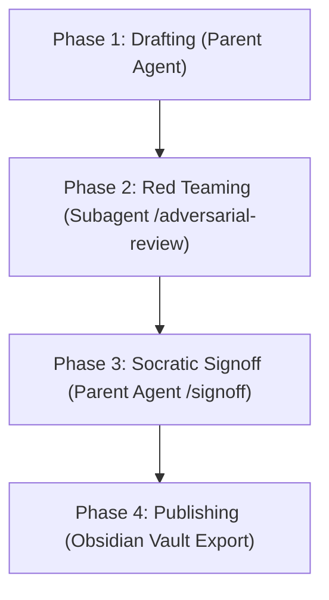

# Math Proof Audit (`/showproof`)

Systematically verify mathematical and statistical implementations in code against formal LaTeX derivations, conduct automated red teaming for subtle numerical/algorithmic bugs, perform Socratic human signoff, and export persistent proof reference notes.

## When to Use

- **Command Trigger:** `/showproof`
- **Automatic Trigger:** Whenever writing, refactoring, or verifying code that implements mathematical models, statistical algorithms, loss functions, probability distributions, matrix computations, or numerical methods.

---

## 4-Phase Audit Workflow



---

### Phase 1: Drafting (Parent Agent)

The parent agent analyzes the target code implementation and generates a draft proof artifact in `<appDataDir>/brain/<conversation-id>/scratch/draft_proof_<concept>.md`.

The draft proof artifact MUST contain:

1. **Formal LaTeX Derivations**:
   - Full mathematical definition of target equations, loss functions, probability density/mass functions, or matrix transformations ($\LaTeX$).
   - Explicit steps showing derivation from baseline mathematical principles to the computational form.

2. **Variable-to-Math Symbol Mapping Table**:
   | Code Variable | Math Symbol ($\LaTeX$) | Domain / Constraints | Description |
   |---|---|---|---|
   | `x` | $X \in \mathbb{R}^{N \times D}$ | Real matrix, non-empty | Input feature matrix |
   | `w` | $W \in \mathbb{R}^{D \times K}$ | Real weights | Model weight matrix |
   | `lr` | $\eta \in (0, 1)$ | Positive scalar | Learning rate parameter |

3. **Line-by-Line Code Alignment**:
   - Quote exact code snippets with line numbers alongside corresponding LaTeX equations.
   - Identify line-by-line correspondences and any implementation shortcuts or approximations.

---

### Phase 2: Red Teaming via Subagent (`/adversarial-review`)

The parent agent spawns an isolated subagent (`invoke_subagent` with `TypeName: self` and `Workspace: inherit`).

> [!IMPORTANT]
> **Subagent Invocation Directive:** The parent agent MUST explicitly include the absolute draft proof path (`<appDataDir>/brain/<conversation-id>/scratch/draft_proof_<concept>.md`) and the empirical script path (`<appDataDir>/brain/<conversation-id>/scratch/temp_math_audit_<concept>.py`) in the subagent prompt. Do not rely on implicit subagent context.

#### Subagent Action Steps:

1. **Empirical Verification Scripts**:
   - Write python test scripts under `<appDataDir>/brain/<conversation-id>/scratch/temp_math_audit_<concept>.py`.
   - **Environment & Dependency Preflight:** Execute scripts using the workspace virtual environment runner and full absolute script path:
     ```bash
     python3 ~/.gemini/scripts/run_in_env.py <workspace_path> python3 <appDataDir>/brain/<conversation-id>/scratch/temp_math_audit_<concept>.py
     ```
   - Dependencies: `sympy`, `numpy`, or `scipy` when available. If optional dependencies are absent in the environment, the script MUST execute pure-Python fallback checks (using `math`/`cmath`) and log a clear preflight notice (`[PREFLIGHT WARNING]: sympy/numpy not installed. Running pure-Python fallback checks...`). Do not fail silently.
   - Compare symbolic mathematical results against exact numerical code outputs.
   - Test floating-point precision, extreme scale values ($10^{-15}, 10^{15}$), and edge vectors.

2. **5-Point Discrepancy Checklist**:
   The subagent MUST audit the implementation against the following 5 discrepancy categories:

   | Category | Common Bug Pattern | Verification Action |
   |---|---|---|
   | **1. Scale & Normalization** | Missing $\frac{1}{N}$, $\frac{1}{\sqrt{d_k}}$, $2\pi$ normalization factors, or loss temperature scaling. | Compare sum vs mean operations; verify scaling factors match math specification. |
   | **2. Indexing & Bounds** | 0-vs-1 indexing shifts, inclusive vs exclusive summation bounds ($\sum_{i=1}^N$ vs `range(0, N)`), off-by-one errors. | Audit loop bounds, array slice indices, and summation limits. |
   | **3. Matrix Dimensions & Transposition** | $XW$ vs $WX$, row vs column vector conventions, improper matrix transposes, `axis=0` vs `axis=1`. | Inspect tensor shapes step-by-step; verify matrix multiplication alignment ($N \times D \cdot D \times K = N \times K$). |
   | **4. Numerical Stability** | Direct $\log(x)$ or $\exp(x)$ without stabilization, division by zero, underflow/overflow, missing epsilon smoothing. | Check for `log1p`, log-sum-exp trick, softmax stabilization (`x - max(x)`), and $\epsilon > 0$ denominators. |
   | **5. Boundary Assumptions** | $x \le 0$, singular/non-invertible matrices, NaNs/Infs, zero-variance inputs, empty inputs, non-positive-definite matrices. | Test zero matrices, negative inputs, singular matrices, and sub-boundary conditions in verification script. |

3. **Report Generation**:
   - Subagent outputs detailed findings detailing passed/failed checklist items and empirical script output.

---

### Phase 3: Socratic Signoff (Parent Agent)

The parent agent synthesizes Red Team findings and presents the draft proof alongside identified edge cases to the user.

1. **Synthesize Findings**:
   - Present draft proof, LaTeX derivation, symbol mapping, and Red Team 5-point checklist results.
2. **Execute Interactive `/signoff` Interview**:
   - Conduct 1-2 targeted Socratic probes per turn across 4 core axes:
     - **Mechanics & Intent:** Explain how code mechanics fulfill LaTeX derivations.
     - **Trade-offs & Approximations:** Highlight any relaxed constraints, truncated series, or numerical approximations.
     - **Boundary Guards:** Verify loud assertions/guards exist for invalid inputs (e.g. NaNs, singular matrices).
     - **Accountability:** Confirm explicit human understanding and approval of mathematical trade-offs.

---

### Phase 4: Publishing (Obsidian Vault Export)

Upon receiving explicit user signoff/approval in Phase 3:

1. **Vault Path Resolution**:
   Resolve target Obsidian Vault directory in the following priority order:
   1. `ANTIGRAVITY_OBSIDIAN_VAULT` environment variable.
   2. `"obsidian_vault_path"` setting in `~/.gemini/antigravity-cli/settings.json`.
   3. Local fallbacks: `~/Desktop/antigravity_vault` or `~/Documents/antigravity_vault`.
   4. Primary workspace fallback: `artifacts/Projects/<project_name>/Proofs/<concept>.md`.

2. **Generate Persistent Proof Reference Note**:
   Save markdown artifact to `Projects/<project_name>/Proofs/<concept>.md` (where `<project_name>` is resolved dynamically from current git repo root and `<concept>` is a slugified concept name).

   *Note: Embed all empirical test logs and results directly within Section 4 of the persistent proof note so the durable document remains self-contained without depending on ephemeral `scratch/` file paths.*

````markdown
# Math Proof Reference: <Concept Name>

- **Date:** <ISO-8601 Date>
- **Target Implementation:** `<repo-relative-path>:L<start>-L<end>`
- **Signoff Status:** `VERIFIED_BY_HUMAN`

---

## 1. Formal Derivation ($\LaTeX$)

$$
<LaTeX derivations>
$$

## 2. Variable-to-Symbol Mapping

| Code Variable | Math Symbol ($\LaTeX$) | Domain | Description |
|---|---|---|---|
| ... | ... | ... | ... |

## 3. Code Alignment

```python
<aligned code snippet>
```

## 4. Red Team Audit & Empirical Verification Summary

- **Empirical Check Suite:** Pure-Python / SymPy Verification
- **Scale & Normalization:** PASSED / FIXED
- **Indexing & Bounds:** PASSED / FIXED
- **Matrix Dimensions & Transposition:** PASSED / FIXED
- **Numerical Stability:** PASSED / FIXED
- **Boundary Assumptions:** PASSED / FIXED

### Embedded Test Output
```text
<empirical script output log>
```

## 5. Attestation & Signoff Record

- **Verified By:** <User Email>
- **Attestation SHA:** <Commit SHA / Attestation Digest>
````
